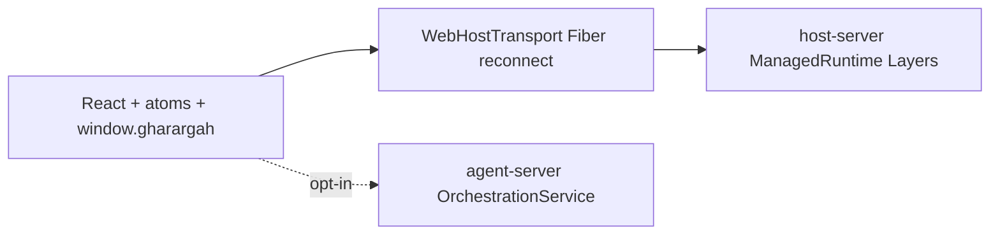

# Effect architecture (host + agents + UI)

Gharargah runs on **Effect 3.x** where it matters for IPC, servers, and long-lived resources: Schema-validated envelopes, Layer DI on both Node servers, Fiber-owned host realtime, and `@effect-atom` roster/modal state in the SPA.

**Correction:** There is **no Rust/Tauri host**. Process/FS/PTY authority is TypeScript [`apps/host-server`](../apps/host-server) + [`@gharargah/node-host`](../packages/gharargah-node-host). Optional Electron shell is a thin `BrowserWindow` supervisor only.

## Packages

| Package | Role |
|---------|------|
| `@gharargah/rpc` | Shared `effect/Schema` envelopes + TaggedErrors for host + agent RPC + SessionRoster |
| `apps/host-server` | Effect Layers + Schema `/api/v1/rpc`; `NodeRuntime.runMain` boot |
| `apps/agent-server` | Effect `OrchestrationService` Layer; Schema WS RPC; Tagged OrchErrors |
| `@gharargah/effect-acp` | ACP stdio client + Effect helpers (`bootstrapAcpClient` for pool, `startAcpClient` scoped, `acpRequest` / `runAcpRequest`) |
| `@gharargah/host-client` | Effect `HostClient` Tag + Schema invoke/events; Promise shim via `createGharargahApi` |
| `@gharargah/app` | `RegistryProvider` + roster/modal/notification atoms |

Pinned via `pnpm.overrides`: `effect@3.22.1`, `@effect/platform@0.97.1`, `@effect/platform-node@0.99.0`, `@effect/platform-browser@0.77.1`.

## Data flow

```
UI (atoms + React)
  → host-client HostClient / createGharargahApi (runPromise shim)
      → POST /api/v1/rpc + WS /ws  →  host-server Layers (FS/PTY/git/LSP/…)
  → agents WS (when GHARARGAH_ENABLE_AGENT_CHAT=1)
      → agent-server OrchestrationService → providers (ACP / Codex / Claude / OpenCode)
```

Wire shapes unchanged: host `{ channel, args, clientId }` → `{ value }` / `{ error }`; agents JSON-RPC `{ id, method, params }`.



## Migration matrix

```text
Area              | Current                         | Effect target                         | Risk | Tests
Transport host    | Fiber + since= + hot decode     | Keep; no platform Socket rewrite      | L    | web-transport.test
Transport agent   | Promise WS + 500ms reconnect    | Fiber backoff (next)                  | M    | defer
Host RPC dispatch | Effect wrapper + tryPromise     | Channel-by-channel later              | H    | defer
Session machine   | Pure reducer + sync store       | Optional Tag later                    | L    | session-machine.test
Terminal data     | Hot WS → xterm + input writer   | Keep imperative                       | L    | terminal E2E
Notifications     | SQLite + PubSub + dual UI state | Unify unread source later             | M    | defer
Persistence roster| One Schema + compat decode      | Done (this pass)                      | M    | rpc + roster + persistence
Git               | GitService Effect; wire loses tag| Preserve GitCommandFailed later       | L    | defer
Editor/LSP        | Promise dispatch + Monaco       | Workspace-scoped Layer later          | H    | defer
```

## Layer graph (host)

```text
makeHostLayers(config)
├── Layer.scoped(HostRuntimeTag)
│   ├── EventHub (ring buffer)
│   ├── makeProjectDatabaseScoped  → ProjectDatabase (acquireRelease close)
│   ├── makeTerminalHostScoped     → TerminalHost (acquireRelease stopAll)
│   └── PubSub<NotificationStreamEvent>
│         → Stream.forkScoped → EventHub "notifications:event"
└── GitServiceLive (GitServiceTag)
```

Tags: `HostConfigTag`, `EventHubTag`, `ProjectDatabaseTag`, `NotificationServiceTag`, `NotificationEventPubSub`, `GitServiceTag`, `TerminalHostTag`, `WorkspaceHostTag`, `PerfHostTag`, `HomeDirTag`, `HostRuntimeTag`.

Process lifetime: `ManagedRuntime.make(hostLayer)` in `server.ts`; disposed on shutdown.

## Error taxonomy

| Source | Errors |
|--------|--------|
| `@gharargah/rpc` | `PathOutsideRootsError`, `UnknownChannelError`, `OperationFailedError`, `NotFoundError`, `ConflictError`, `PayloadTooLargeError`, `HostDisconnectedError`, `GitCommandFailedError`, `LspCrashedError`, `InvalidRpcPayloadError`, `AgentRpcError` |
| Wire | `hostErrorWire` → `{ code, message, details? }` |
| agent-server Orch | `ThreadNotFoundError`, `TurnAlreadyRunningError`, `ApprovalBlockedError`, `AgentCommandError` → WS `error: string` today |

Expected operational failures stay in the typed channel; defects stay defects. Do not collapse disconnect / interrupt / process exit into one UI string.

## Resource ownership

| Resource | Owner | Outlives UI? | Release |
|----------|-------|--------------|---------|
| Remote PTY | host `TerminalHost` | yes | `terminal:dispose` / runtime dispose `stopAll` |
| Host WS | `WebHostTransport` Fiber | yes (app session) | transport `close()` |
| Agent WS | `createEffectAgentsClient` | while agent chat enabled | `close()` |
| xterm + addons | `TerminalPanel` mount | **no** | unmount dispose |
| Modal open | roster atom / UI | n/a | close = detach only |
| Monaco model | model registry (when used) | yes across tabs | dispose when unused |
| LSP session | host `/ws/lsp/{id}` | workspace scope | `lsp:stop` |
| SQLite `jet.sqlite3` | `ProjectDatabase` Scope | process | `close()` idempotent |
| Agent events DB | agent-server store | workspace | process exit |

**Invariant:** modal close / `gharargah.goHome` = UI detach. Does **not** stop remote PTY.

## Session state machine

Statuses: `starting | running | exited | failed`  
Events: `PtyBound`, `PtyUnbound`, `ProcessExited`, `Failed`, `AwaitResume`, `Restart`, `MarkDone`, `Hydrate`  
Reducer: pure `nextSessionStatus` in `@gharargah/app` `effect/session-machine.ts` — permissive (all statuses accept all events today, matching historical mutators). Production store is sync `defaultSessionStore`; `SessionRuntime` Tag exists for tests/future.

## Protocol schemas (`@gharargah/rpc`)

| Schema | Transport |
|--------|-----------|
| `HostRpcRequest` / `HostRpcSuccess` / `HostRpcFailure` | HTTP `POST /api/v1/rpc` |
| `HostEvent` (+ hot structural decode for `terminal:data`/`exit`) | WS `/ws?since=` |
| `AgentRpcRequest` / success / failure / push | WS `/agents` |
| `SessionRoster` / entry / modal + compat decode | localStorage + `GET/PUT /api/v1/sessions` |

### SessionRoster compatibility decisions

- Accept persisted `version` 1 or 2; always emit `version: 2`
- Drop entries missing `tabId` / `cwdRootUri`
- Drop `agentId` without `launchCommand` (agent stubs incomplete); **blank shells allowed** on decode / PUT
- Host SQLite reopen migration (`ensureSessionRosterSchema`) deletes incomplete agent stubs only (`agent_id` set, no `launch_command`); blank shells and open agent sessions survive host restart
- Open/reload never prunes roster cards — missing PTYs mark `starting` for respawn; done sessions stay in Done sidebar section
- Map legacy status `interrupted` → `failed`
- Default unknown/missing status → `starting`
- Dedupe by `tabId`; clear orphan modal
- Filter `launchArgs` to strings ≤ 32 768 chars
- Structurally invalid PUT body → HTTP 400 (`tryDecodeSessionRoster` → `null`); corrupt localStorage → empty roster (`decodeSessionRosterUnknown`)

## Agent-server

- `OrchestrationLive` = `AgentStoreLive` + `EventSinkLive` + engine with injected store
- Engine throws Orch TaggedErrors; WS still stringifies `error`
- Boot: `startAgentServerEffect` + Schema `decodeAgentRpcRequest`

### Model discovery

`agents:refreshAgents` / `agents:refreshProviders` probe providers (60s TTL cache):

| Agent | Discovery |
|-------|-----------|
| Codex | `codex app-server` → `model/list` (paginated) |
| Cursor | `cursor-agent models` CLI (+ session `cursor/list_available_models`) |
| OpenCode | `opencode models` CLI |
| Claude | built-in sonnet/opus/haiku (+ effort config) |
| Grok | `auto` until session `models` state arrives |

### Drivers

| Agent | Primary driver | Notes |
|-------|----------------|-------|
| Cursor / Grok | ACP | pooled via `bootstrapAcpClient`; RPC via `runAcpRequest`; idle reap 30m; host MCP loopback |
| Codex | app-server | streams until `turn/completed` |
| Claude | `@anthropic-ai/claude-agent-sdk` | mock binary in E2E |
| OpenCode | `@opencode-ai/sdk` | `promptAsync` + SSE |

**ACP Effect rules:** pool owns client lifetime (idle reap / force-stop). `startAcpClient` is Scope-bound for ephemeral use only — never acquireRelease a pooled client inside a turn Scope.

### Env

| Var | Meaning |
|-----|---------|
| `GHARARGAH_AGENT_RUNTIME` | `effect` (default) |
| `GHARARGAH_AGENT_HOST` | default `127.0.0.1` |
| `GHARARGAH_AGENT_PORT` | default `4751` |
| `GHARARGAH_AGENT_WS_URL` | override WS URL (E2E) |
| `GHARARGAH_AGENT_MOCK=1` | mock ACP / deterministic streams |
| `GHARARGAH_ENABLE_AGENT_CHAT` | opt-in in-app ACP chat (default off — ADE uses PTY CLIs) |

## Host-server

- Context Tags in `apps/host-server/src/effect/`
- `dispatch()` returns `Effect.Effect<unknown, HostRpcError, HostRuntimeTag>`
- RPC: Schema decode `HostRpcRequest` → Effect dispatch → `hostErrorWire` / `hostErrorHttpStatus`
- PTY: `makeTerminalHostScoped` via `Layer.scoped` + `ManagedRuntime`
- ProjectDatabase: `makeProjectDatabaseScoped` — closed on ManagedRuntime dispose
- Git: `GitServiceTag` + `GitServiceLive`; `GitCommandFailedError` remapped to wire `OPERATION_FAILED` today
- Notifications: `PubSub` → Stream → EventHub `notifications:event` (SQLite SoT)
- Boot: ManagedRuntime open for process life (not per-request scope)

## Frontend

- `main.tsx`: `RegistryProvider` + `window.gharargah` Promise shim + `__gharargahHostClientLive`
- Atoms: `rosterAtom`, `terminalModalAtom`, `openTerminalTabIdAtom`, `notificationCenterAtom`
- **HostRealtime** (`WebHostTransport`): Fiber reconnect (250ms×2^n cap 10s, `?since=`); hot path for terminal; abort in-flight HTTP with `HostDisconnectedError`
- **SessionRuntime**: Tag + pure machine; sync facade in `tabs/terminal-session.ts`
- Terminal output: **not** React state — WS → xterm.write
- E2E: `window.__gharargahAgent` unchanged

## Remaining risks / next slices

1. Agent WS Fiber reconnect + Schema push decode (align with host backoff)
2. Effect-native `dispatch` channels (terminal / notifications / LSP) without `tryPromise` wrappers
3. Single unread source (`notificationCenterAtom` vs `useNotificationCenter`)
4. Preserve `GitCommandFailed` on wire / client
5. Editor/LSP workspace-scoped Layers (Monaco models stay imperative)

## Dev / smoke

```bash
pnpm --filter @gharargah/agent-server start
curl -s http://127.0.0.1:4751/health
pnpm --filter @gharargah/host-server start
curl -s http://127.0.0.1:4747/health
pnpm -r typecheck
pnpm test:e2e
```

## Prior art

Design invariants for agents (command receipts, approval blocking, ACP idle) take inspiration from `.t3code`. Implementation is Gharargah-authored.
